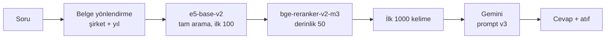
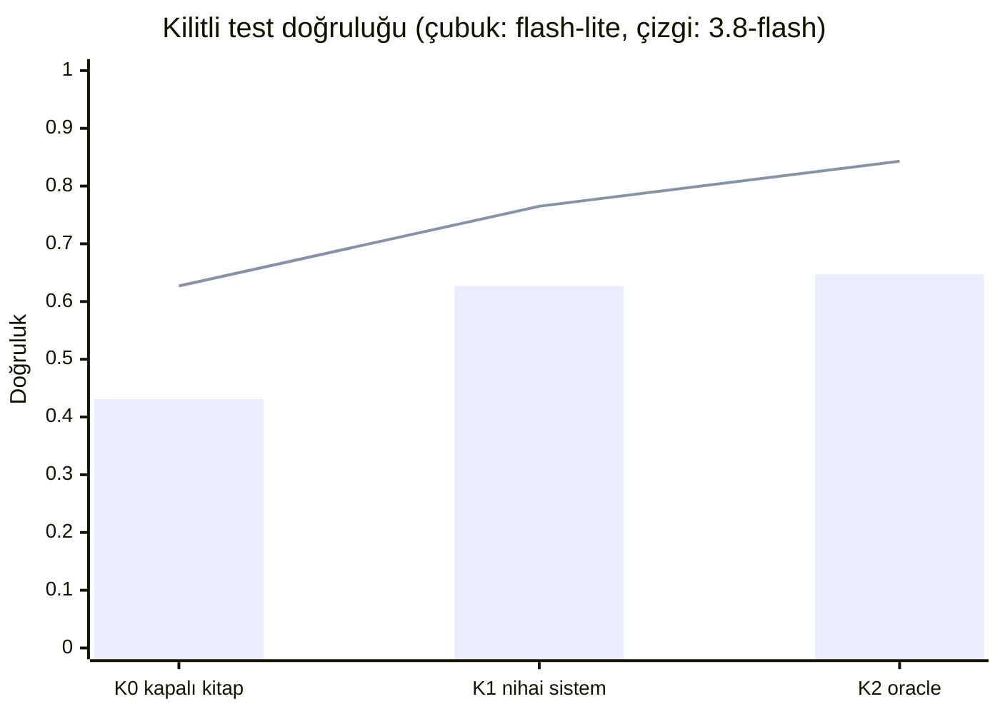

# Ölçülmüş Finans RAG'i

SEC dosyalarından (10-K, 10-Q, 8-K) finansal soruları cevaplayan bir RAG hattı.
Her bileşen **ölçümle** seçildi. Her deney, sonuçtan önce yazılmış ölçütle kayıt altına alındı. Olumsuz sonuçlar da raporlandı.

Cevaplar Gemini API ile üretilir. Arama yerelde çalışır. Değerlendirme FinanceBench üzerinde, cevap düzeyinde yapılır.

## Hat



Veri: PDF → sayfa → 200 kelimelik chunk (sayfa sınırlı).
Her sistem **aynı 1000 kelimelik bağlamı** alır. Karşılaştırmalar adil kalır.

## Sonuç: kilitli test

51 soru, 11 şirket. Küme baştan ayrıldı ve tek seferde ölçüldü. Sıkı puanlama: "kısmen" yanlış sayılır.

| Okuyucu model | Kapalı kitap (K0) | **Nihai sistem (K1)** | Oracle sayfa (K2) |
|---|---|---|---|
| gemini-3.5-flash-lite | 0,431 | **0,627** | 0,647 |
| gemini-3.8-flash | 0,627 | **0,765** | 0,843 |



K0: model belge görmez. K1: sistemin bulduğu bağlam. K2: altın kanıt sayfası (üst sınır).

**K1 − K0 farkı** (%95 aralık, şirket-kümeli bootstrap):

| Okuyucu | Fark | Sonuç |
|---|---|---|
| flash-lite | **+0,196** [+0,024; +0,356] | Anlamlı |
| 3.8-flash | **+0,137** [−0,024; +0,262] | Yön pozitif, 51 soruda kanıt yetersiz |

- Ön kayıtlı sonuç: **kısmen desteklendi.** Yumuşak puanlamada ("kısmen" doğru) iki okuyucuda da anlamlı.
- Retrieval: Recall@1000w 0,532. Altın sayfa 31/51 soruda bağlama girdi.
- Bağlamda olmayan (uydurma) atıf yok.

Tüm sayılar ve sınırlar: [KARAR_GUNLUGU.md](KARAR_GUNLUGU.md) (Karar 14).

## Ne ölçtük, ne çıktı

Geliştirme kümesi: 99 soru, 21 şirket.

| Karar | Sonuç |
|---|---|
| Dense mi, BM25 mi | Dense net üstün. Dört dense model ayırt edilemedi (e5-base-v2 seçildi) |
| Reranker | Anlamlı kazanç |
| Chunk boyu | 200 kelime kaldı |
| Belge künyesi, BM25 hibriti | İkisi de ön kayıtlı ölçütle **reddedildi** |
| Vektör veritabanı | Chroma doğrulandı (ilk-50 örtüşmesi 0,98). Nihai testte kullanılmadı: yönlendirme filtresi doğrulanmadı |
| Belge yönlendirme | Recall@1000w 0,409 → 0,504 (anlamlı). Cevap doğruluğuna tek başına anlamlı katkı yok |
| Prompt v3 ("bağlam yetmezse kendi bilginle cevapla, belirt") | Güçlü okuyucuda +0,081 [+0,034; +0,132]. Uydurma atıf artmadı |

## Cevap metriği

Katmanlı. Önce deterministik kurallar, sonra yargıç model.

| Gold cevap türü | Puanlama |
|---|---|
| Sayısal | Altın ondalıkların hassasiyeti |
| Evet/Hayır | Hüküm eşleşmesi |
| Birden fazla anahtar sayı | Hepsi bulunmalı |
| Serbest metin | Yargıç: gemini-3.7-flash (okuyucu değil). 128 insan puanına karşı kalibre: ikili uyum 0,945 |

Atıf metrikleri ayrı: isabet, kesinlik, bağlamda bulunma.

## Sınırlar

- 51 test sorusu, 11 şirket. Aralıklar geniş. "Etki yok" değil, "kanıt yetersiz" denebilir.
- Kilitli testte 306 cevabın 90'ı yargıçla puanlandı. Yargıç hafif katı. Tek bir insan puanlayıcıyla kalibre edildi. Yargıç ve okuyucu aynı model ailesinden.
- Geliştirme kümesinde ardışık birkaç müdahale denendi (iyimserlik riski). Kilitli testte beklenen düşüş görülmedi. Kilitli küme daha kolay olabilir.
- Başlangıç hattının üstünlüğü yalnız geliştirme kümesinde gösterildi. Kilitlide çalıştırılmadı.
- Ön-eğitilmiş modellerin SEC metnini görmüş olma ihtimali doğrulanamaz.
- Fine-tune yapılmadı (isteğe bağlı ek, Karar 11).

## Maliyet

Okuyucu ve yargıç API çağrıları toplam ≈ 239 TL (≈ 4,35 USD). Önceden konan sınır: 350 TL. Harcama tavanı koddadır. Her çağrı önbelleğe yazılır.

## Veri ve lisans

| Veri | Rol | Lisans |
|---|---|---|
| FinanceBench (Patronus AI) | Değerlendirme: 150 soru, 360 belge, 53.399 sayfa | CC-BY-NC-4.0 (ticari kullanım yok) |
| FinQA | Fine-tune için ayrılmıştı, kullanılmadı | MIT |

Veri repoda **yok** (`data/` gitignore'da). Yeniden dağıtım sayılır. `src/veri_indir.py` ile lokalde indir.
Sızıntı denetimi yapıldı (aynı sayfa ve metin örtüşmesi yok). Bölme şirket bazında: 99 geliştirme + 51 kilitli.
**Kod: MIT** ([LICENSE](LICENSE)).

## Yeniden üretme

1. `pip install -r requirements.txt` (sürümler sabit).
2. `GEMINI_API_KEY` ortam değişkenini ayarla. Anahtar koda veya repoya girmez.
3. Sıra ve ön kayıtlar `KARAR_GUNLUGU.md` içinde. Ana betikler:

| Betik | Görev |
|---|---|
| `src/degerlendir.py` | Retrieval metrikleri, bootstrap, kilitli küme koruması |
| `src/yonlendirme.py`, `rerank.py`, `baglam_hazirla.py` | Arama hattı ve istekler |
| `src/okuyucu_gemini.py` | Okuyucu (önbellek, harcama tavanı, dry-run varsayılan) |
| `src/yargic_gemini.py` | Yargıç ve kalibrasyon |
| `src/kilitli_hazirla.py`, `kilitli_calistir.py`, `kilitli_olc.py` | Tek seferlik kilitli test |

4. `tests/` altındaki testler API'siz çalışır (sahte istemci). Örnek: `python tests/test_cevap_metrik.py`.

Kilitli küme bir kez kullanıldı. İkinci ölçüm için kullanılamaz.

## Klasörler

```
├── KARAR_GUNLUGU.md   her karar ve deney: gerekçe, ön kayıt, sonuç
├── src/               indirme, parse, retrieval, okuyucu, yargıç, ölçüm
├── tests/             API'siz testler
├── sonuclar/          ölçüm çıktıları (JSON), dondurulmuş prompt'lar
└── data/              ham ve işlenmiş veri (gitignore)
```
